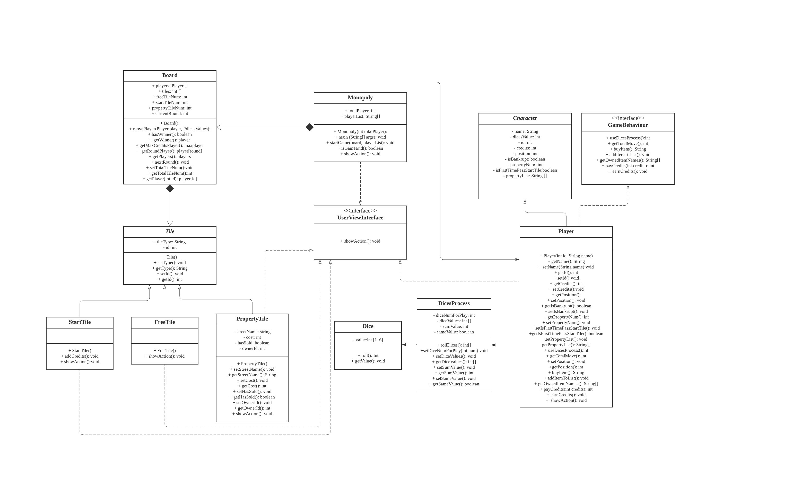
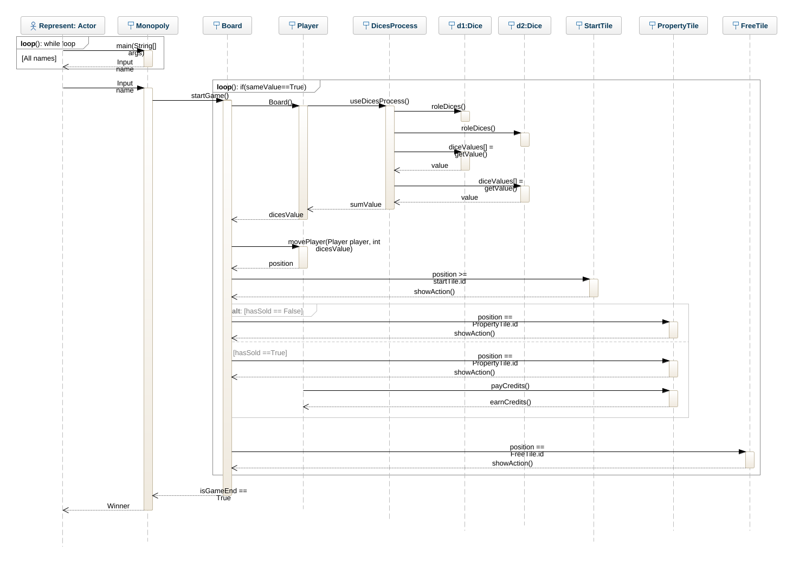

************************

# Assignment-2 model 
Author: Yuyao Duan  
Program: Software Technology  
Course: 1DV502
 Date of submission: 2021-02-14

## Part 1: UML Class Diagram

(Applied tool: Lucidchart)

**Discribtion of this diagram:** This design includes 12 classes consisting of 2 interfaces, 2 abstract classes, and 8 normal classes. The class ``"Monopoly"`` includes ``main(String[] args)`` method to start this program. The game consists of a ``"Board"`` which includes several different kinds of tiles to construct this board. The ``"Tile"`` class is an abstract class including the common attributes and operations of three types of sub-classes which are ``"StartTile"``, ``"FreeTile"``, ``"PropertyTile"``.

The ``"Player"`` class is another important part of this which inherits the abstract class ``"Character"`` including varous common attributes that a gamer needs to have. On the other hand, this ``"Player"`` class also implements the interface ``"GameBehaviour"`` composed of related game behaviours in this game. The idea if this design is enlighten by the provided online series lectures and book *The Object-Oriented Thought Process*. The purposes of designing this interface is related to a vision of industrial developer. Interface can be considered as an implementation standard in the related fields. To create this standard benefits the organzation's long-term development. The company can position itself as an expert to develop degital board games which the interface can be reused as an guideline for implementing the roles/players in all sorts of similar board games.

The ``"Player"`` class will use ``"DicesProcess"`` class to get the value of dices. ``"DicesProcess"`` will use ``"Dice"`` class. The idea of this design is enligened by lecture "developing dice-game variant". Implementing this design can make the game rule more flexible, e.g. we now want to use three or more dices for this board game which can be easily changed. 

Besides, the visualized user interface is designed as ``"UserViewInterface"`` which includes the method ``showAction()`` that other components of this game need to implement this interface and override this method. When game interactions happened, the console interface will show different game actions, like discribed in the document: player moves, credits change, buy property, or pay rent etc.)

## Part 2: UML Object Diagram

(Applied tool: Genmymodel)

**Discribtion of this diagram:** This diagram gives an overview about when the game started which objects will be initiated and how do they interaction with each other. One point to mention is that due to the applied tool which the *arrows* and *lines* are different from the lecture slides (Lecture - Fundamental OO "Object Model - Object Diagrams" showing the line is solid while Genmymodel only provided with dotted-line arrows to discribe object diagram). 

When actor starts this game, the ``"Monopoly"`` class will generate the object ``"m:Monopoly"``. The constructor of ``"Monopoly"`` will also initiate the board object ``"b:Board"``. The ``"b:Board"`` will also initiate three different types of tiles, ``"st:StartTile"``, ``"ft:FreeTile"``, and ``"pt:PropertyTile"``. ``"b:Board"`` will also initiate and use object ``"p:Player"``. ``"p:Player"`` will use ``"dp:DicesProcess"`` object to get dice values which the object ``"dp:DicesProcess"`` needs object ``"d:Dice"``.  

## Part 3: UML Sequence Diagram

(Applied tool: Genmymodel)

**Discribtion of this diagram:** This diagram provides a dynamic view about this software design when program running. In the begining, when actor starts the the main program ``"Monopoly"``, it will require user to input name. This will be designed as a loop until all gamers input their names. When this finished, ``"Monopoly"`` will start the game and initiate constructor ``board()`` to initiate ``"Player"``. ``"Player"`` will use ``"DicesProcess"`` to get dice faces for movement. ``"Player"`` will continue roll dices as long as the two dices have same value. The ``"Board"`` will use the value to change user's positions. By using the position, the ``"Board"`` will determine whether the ``"Player"`` stands on one of the three types of tiles. After departure, if user again passes or standes on the ``"StartTile"``, ``showAction()`` method will add 200 credits. If user stands on ``"PropertyTile"`` and the property has not been sold then the user can choose to buy; otherwise the user need to pay the property owner. If user stands on ``"FreeTile"``, there will be nothing special but report the user's status. After 10 rounds of this game, ``"Board"`` will announce the winner and ``"Monopoly"`` will show who is the winner in the end.

