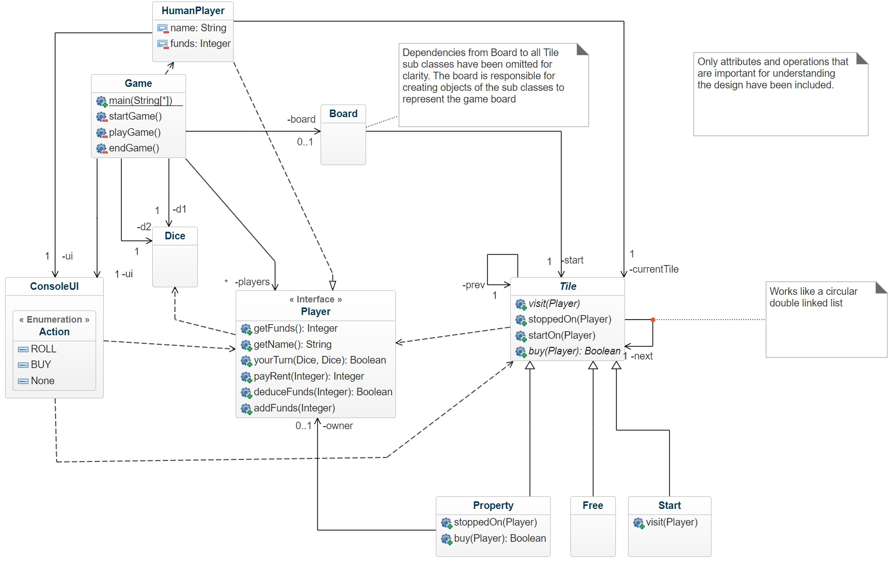

************************

# Assignment2 Report 
Author: Yuyao Duan
 Program: Software Technology  
Course: 1DV502 
 Date of submission: 2021-03-21

## Introduction  
This report is an important part of Assignment 2 - Object Oriented Design of course 1DV502/1DT904 which includes comprehensive knowledge in this field. The assignment is conducted through Java programming language. The first part of this assignment includes three designs of The Monopoly Game - UML Class Diagram, UML Object Diagram, and UML Sequence Diagram in order to present an accurate understanding of software requirements which will be basis of this reflection report. The report structure is as follows, first of all, a comparison of class diagram will be presented which will cover all the concerend topics of assignment instructions. Furthermore, a reflection of object diagram and sequence diagram will be given and the design differences compared to lecturer's proposal will be pointed out. The last but not least, a general summary and comparison of my initial design and the mature design will be pointed out, and the lessions the author learned will be discussed.

## Part 1: UML Class Diagram Design
- Class diagram comparison 

(UML Class Diagram Comparison)

In the initial design, there are 12 classes in the design which share the similar design thinking compared to the proposed mature design's 10 classes. The similar parts include: the abstract ``"Tile class"`` and three inherited tile classes - ``"PropertyTile"``, ``"StartTile"``, and ``"FreeTile"``; the ``"Board"`` class; the ``"Monopoly"`` class which is same as the ``"Game"`` class from the proposed design; ``"UserViewInterface"`` is same as ``"ConsoleUI"``.

The initial design has two parts different from the proposed design – the player part and dice part. In the initial design, the ``"Player"`` class, which has the similar funciton as the ``"HumanPlayer"`` class of the proposed design, is constructed and implemented in a different way. The initial design is enlightened by the book *The Object-Oriented Thought Process* that creating one class for encapsulating all the attributes and creating one interface for standardizing behaviour. This notion will help expand operation standardized extension all the related implementation such as ``"ComputerPlayer"`` class. The developer can only make this new class to inherit and implement the above two classes. In terms of the dice part, the initial design over-complicated this function by adding one more class ``"DicesProcess"`` compared to the proposed design that is strongly influenced by lecture samples which can be considered as unnecessary redundant at present. In the proposed design the ``"ConsoleUI"`` class has many encapsulated methods while in the initial design was devised as an interface that all the related classes need to implement. By comparison, the proposed design has a better realization of class functionality that the operational methods may need to implement in all the related classes in the initial design. 

With respect to the differences among the relationships between classes, the one of the most significant aspect is that the proposed design has better "high cohesion and low coupling" feature compared to the initial design. The initial design used two composition relationships to construct that ``"Tile"`` is a part of ``"Board"`` and ``"Board"`` is part of ``"Monopoly"`` which can be considered as an unnecessary coupling relationship. The proposed design utilized more dependency and association relationships making this application more flexible which is a valuable lession earned from the mature plan. The initial plan implemented an association relation since the constructor of ``"Board"`` class will use ``"Player"`` objects. The id-connections were unintentional implemented during the design in order to link the ``"Player"`` objects and ``"Tile"`` objects i.e. to show what is the current position of the player. This can be seen as a design weekness that violates the general requirement of software encapsulation. This makes the game harder to make changes later on.

In terms of division of complexity and behaviour, the initial design intended to follow the notion that a class should be assigned as a tight responsibility. There are six main parts in the initial design: ``"Tile"`` related classes, ``"Board"`` class, ``"Monopoly"`` class contains the main method, ``"UserViewInterface"`` interface, ``"Dice"`` related classes, and ``"Player"`` related classes. From this perspective, all the classes perform their different duties which matches the object-oriented thought.

## Part 2: UML Object Diagram Design
- Object diagram comparison

(UML Object Diagram Comparison)

The differences between the initial design and the proposed design of object diagram include many aspects. To start with, the objects of the initial design are more general which does not present the detailed object such as ``"Boris"``, ``"Downing Street: Property"``, ``"Seven Sisters Road: Property"`` etc. The proposed design also shows the methods that are used for linking the objects such as ``"currentTile"``, ``"currentPlayer"``, ``"prev"``, ``"next"`` which are missed in the initial design. Furthermore, the proposed design also includes a few important attribute's values to simulate the instruction's description. By comparison, the flaw of the initial design is that it does not use the valuable clue – the scenario description to more accurately represent a static status of the program's objects.

## Part 3: UML Sequence Diagram Design
- Sequence diagram comparison

(UML Sequence Diagram Comparison)

Same as the object diagram, the main differences between the initial design and the proposed design is that the proposed plan used described scences to present the sequence diagram while the initial plan express the process in a more general way. To express the the player moving between different tiles, the initial design applied id-connections to present the player's movement while the proposed design utilized different objects to realize the player's movement. The proposed design includes more detailed descriptions regarding how to move between different tiles and what methods should be called. Another merit that the initial plan should learn from the proposed design is that the initial design should provide additional supplementary information description for readers to have better understanding of it.  

## Design reflection and lessons learned

### Design reflection 

As people say, "program is equal to algorithm plus data structure". Though this statement is somewhat general, the importance of careful consideration of data structure can be found in this software design. To realize a object-oriented "game board", the data structure of the "tiles" is the highlight of the proposed design which is the disadvantage of the initial design. The unintentional design of id-connections between "players" and "tiles" violates the generial rule "high cohesion and low coupling" of objected-oriented programming thinking. To realize software reusability, each class of the design should be assigned with tight function and the functional complexity should be divided. In the initial design, the ``"UserViewInterface"`` interface should be designed as encapsulated class with all sorts of UI behaviours instead of being an real interface. The initial design need all related classes to implement the UI-behaviours which will lead to the other classes mixed with UI methods. This, however, violates "classes should have tight function" rule.

### Learned lessons
After practicing this assignment, I have gained an overview of object-oriented software design. The actual operation is far more difficult than the imagined process. Though the previous courses have comprehensively trained the algorithm ability, understanding and implementing appropriate data structure are the personal weaknesses which I identified during this assignment. Putting effort on learnig data structure will be my focus in the next stage study.

In order to achieve flawless object-oriented program, the design process should well aware the hidden dependencies and connections. The program should be designed to call and traverse different objects instead of applying similar "id-connections" which actually violates encapsulation. 

In terms of class design, the initial design implemented redundant class ``"DicesProcess"`` which can be avoided after conducting deeper consideration of functionality of classes. Like the proposed design achieved, flexibly calling the created objects and complying more functions with the existing classes are important lessons learned from this assignment.

